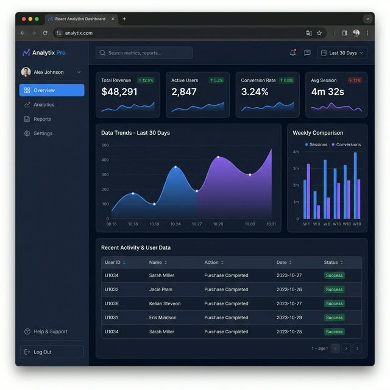

# Real-Time Business Dashboard

A highly responsive React analytics dashboard designed to visualize complex business metrics instantly and securely via any REST API.

✔ Increases executive decision-making speed by turning raw data into actionable KPI charts
✔ Works immediately without a backend via built-in mock data generators for rapid prototyping
✔ Ensures enterprise-level performance and caching using TanStack Query and TypeScript

## Use Cases
- **Executive Reporting:** Provide founders and CEOs with a real-time overview of revenue, active users, and recent orders.
- **SaaS Admin Panels:** Drop this modular dashboard directly into any existing SaaS application to manage users and inventory.
- **Client Portals:** Give B2B clients a white-labeled view of their campaign or product performance metrics.

## Project Structure

```
react-analytics-dashboard/
├── src/
│   ├── api/
│   │   ├── client.ts        # Axios instance + JWT interceptor
│   │   └── metrics.ts       # API functions + mock data generators
│   ├── components/
│   │   ├── KpiCard.tsx
│   │   ├── RevenueChart.tsx
│   │   ├── TopProductsTable.tsx
│   │   └── OrdersTable.tsx
│   ├── hooks/
│   │   └── useMetrics.ts    # TanStack Query hooks
│   ├── App.tsx
│   ├── main.tsx
│   └── index.css
├── package.json
├── vite.config.ts
├── tailwind.config.js
└── .env.example
```

## Setup

```bash
npm install
cp .env.example .env
npm run dev
```

Open: http://localhost:3000

## Connecting to a Real API

Set `VITE_USE_MOCK=false` in `.env` and configure `VITE_API_BASE_URL`. Your API should expose:

| Endpoint | Returns |
|---|---|
| `GET /api/metrics/kpis` | KPI cards array |
| `GET /api/metrics/timeseries?days=30` | Time series array |
| `GET /api/metrics/products` | Top products array |
| `GET /api/metrics/orders/recent` | Recent orders array |

## Tech Stack

`React 18` · `TypeScript` · `Vite` · `Recharts` · `TanStack Query` · `Tailwind CSS` · `Axios`

## Screenshot



